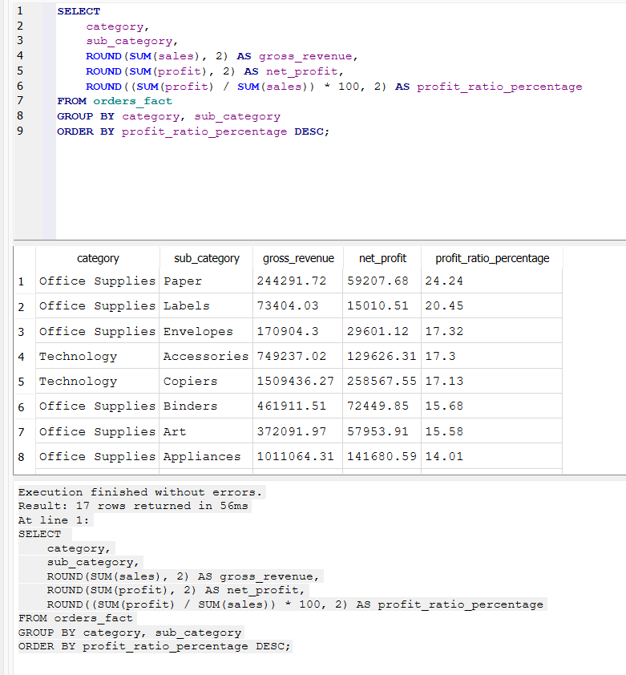
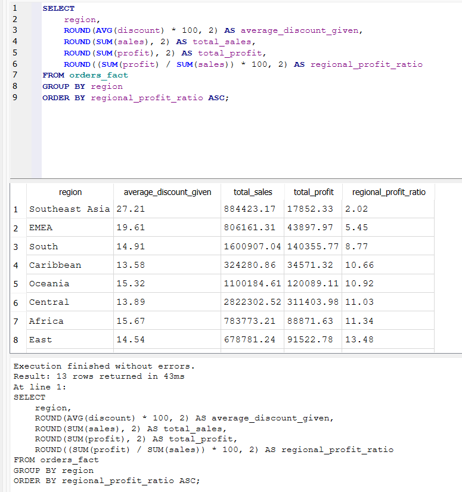
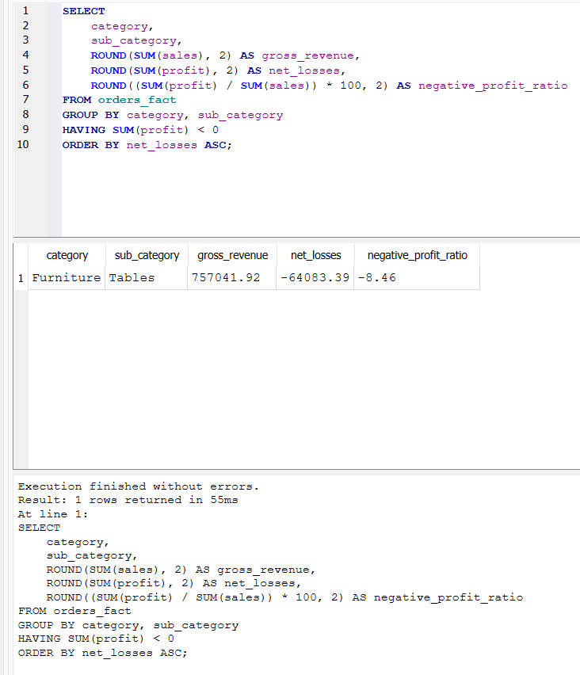
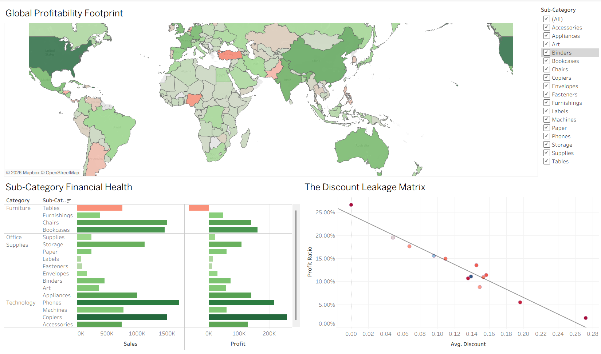

# Retail Profitability Intelligence

A comprehensive data analysis project analyzing Global Superstore transactional data to uncover profit-draining categories, optimize inventory turnover, and identify seasonal product behavior in retail operations.

## 📊 Project Overview

This project analyzes transactional retail data to provide actionable insights for improving business profitability. By combining SQL for data processing, Python for data staging and warehouse management, and Tableau for interactive visualization, this analysis delivers strategic recommendations for inventory optimization and profitability improvement.

### Key Objectives

- **Profit Analysis**: Identify profit-draining categories and sub-categories across regions
- **Inventory Optimization**: Analyze inventory turnover rates and their correlation with profitability
- **Seasonal Behavior**: Discover seasonal product trends and demand patterns
- **Strategic Planning**: Provide data-driven recommendations for inventory and pricing strategies

## 🛠️ Tools & Technologies

| Component | Tools |
|-----------|-------|
| **Data Source** | Global Superstore CSV Dataset |
| **Data Warehouse** | SQLite (superstore_warehouse.db) |
| **Data Processing** | SQL, Python (Pandas, SQLAlchemy) |
| **Data Analysis** | SQL Analytics Queries |
| **Visualization** | Tableau Desktop (TWBX format) |
| **Reporting** | PDF Reports, PNG Outputs |

## 📁 Project Structure

```
retail-profitability-intelligence/
├── README.md                                              # Project documentation
├── data/                                                  # Raw and processed datasets
│   ├── Global_Superstore2.csv                            # Source data (12MB)
│   └── superstore_warehouse.db                           # SQLite data warehouse
├── src/                                                   # Source code
│   ├── stage_warehouse.py                                # Data import and warehouse staging
│   └── profit_analytics.sql                               # Profitability analysis queries
├── documents/                                            # Analysis reports
│   └── Global_Superstore_Profitability_Analysis.pdf     # Executive analysis report
├── outputs/                                              # Query results and visualizations
│   ├── sql_query_1_results.png                          # Profitability analysis results
│   ├── sql_query_2_results.png                          # Category performance results
│   ├── sql_query_3_results.png                          # Regional analysis results
│   └── tableau_executive_dash.png                       # Dashboard preview
└── Global Superstore Profitability Control Room.twbx    # Interactive Tableau dashboard
```

## 📸 Outputs

### SQL Query 1 Results


### SQL Query 2 Results


### SQL Query 3 Results


### Tableau Executive Dashboard


## 🚀 Quick Start

### Prerequisites

- Python 3.7+
- SQLite (included with Python)
- Tableau Desktop (for dashboard development) or Tableau Reader (for viewing)
- Required Python libraries:
  ```bash
  pip install pandas sqlalchemy
  ```

### Workflow

1. **Setup Data Warehouse**
   ```bash
   python src/stage_warehouse.py
   ```
   - Loads Global Superstore CSV data into SQLite database
   - Creates normalized data warehouse schema
   - Prepares data for analysis

2. **Run SQL Analytics**
   - Execute queries from `src/profit_analytics.sql` to calculate:
     - Profit margins by category and sub-category
     - Regional performance metrics
     - Seasonal demand patterns
     - Inventory efficiency indicators

3. **Review Analysis**
   - Check `documents/Global_Superstore_Profitability_Analysis.pdf` for detailed findings
   - View `outputs/` directory for visualization previews

4. **Interactive Dashboard Exploration**
   - Open `Global Superstore Profitability Control Room.twbx` in Tableau Desktop
   - Filter by Region, Product Category, and Season
   - Drill down into detailed profitability metrics
